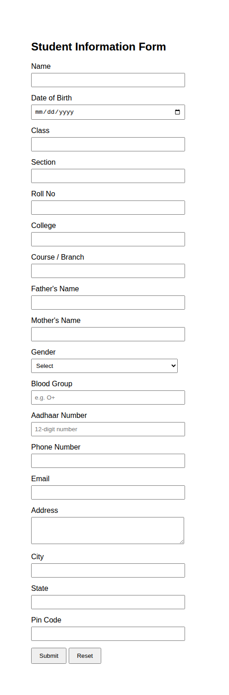

# Student Information Form

A simple, single-page HTML form built with inline CSS (no external stylesheets, no JavaScript, no backend).

## Files

- `index.html` — the form itself

## Fields

1. Name
2. Date of Birth
3. Class
4. Section
5. Roll No
6. College
7. Course / Branch
8. Father's Name
9. Mother's Name
10. Gender
11. Blood Group
12. Aadhaar Number
13. Phone Number
14. Email
15. Address
16. City
17. State
18. Pin Code

## Buttons

- **Submit** — standard HTML form submit (no backend connected, so it won't send data anywhere on its own)
- **Reset** — clears all fields back to empty

## How to use

Just open `index.html` in any browser — no setup, no dependencies, no server required.

## Output

## Notes

- Styling is done entirely with inline `style` attributes, kept minimal on purpose.
- To actually collect submissions, you'd need to add a backend/`action` attribute (e.g. a form endpoint like Formspree, or your own server) — intentionally left out per requirements.
